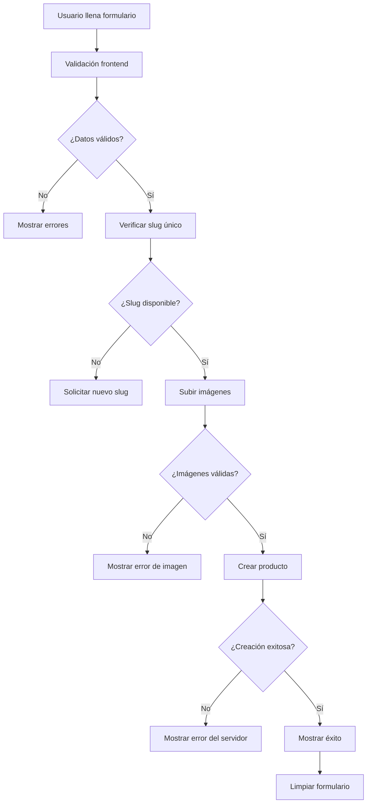

# 🚀 Implementación del Endpoint POST /products

## 📋 Resumen

Este documento describe la implementación completa del endpoint `POST /products` para la creación de productos en Green Cycle Connect & Share. La implementación incluye validaciones robustas, manejo de errores, carga de imágenes y todas las funcionalidades especificadas.

## 🏗️ Arquitectura Implementada

### 1. **Tipos de Datos** (`src/types/product.ts`)

```typescript
export interface CreateProductDto {
  // Campos obligatorios
  name: string;
  description: string;
  slug: string;
  images: string[];
  category: string;
  condition: 'new' | 'like_new' | 'good' | 'fair' | 'poor';
  seller: string;
  location: Location;
  
  // Campos opcionales
  subcategory?: string;
  price?: number;
  currency?: string;
  forBarter?: boolean;
  barterPreferences?: string[];
  stock?: number;
  stockUnit?: string;
  isUnlimitedStock?: boolean;
  ecoBadges?: string[];
  ecoSaving?: number;
  sustainabilityScore?: number;
  materials?: string[];
  isHandmade?: boolean;
  isOrganic?: boolean;
  shippingOptions?: ShippingOptions;
  status?: 'draft' | 'active' | 'paused' | 'out_of_stock' | 'sold' | 'archived';
  isVerifiedSeller?: boolean;
  tags?: string[];
  searchKeywords?: string[];
  metadata?: ProductMetadata;
}
```

### 2. **Servicio de Productos** (`src/services/productService.ts`)

El servicio incluye:

- ✅ **Validaciones previas** antes de enviar al servidor
- ✅ **Valores por defecto** para campos opcionales
- ✅ **Manejo de errores específicos** (400, 401, 409, 413)
- ✅ **Verificación de slug único**
- ✅ **Carga de imágenes con validaciones**
- ✅ **Métodos para categorías y subcategorías**

```typescript
export const productService = {
  async createProduct(productData: CreateProductDto): Promise<ProductResponse> {
    // Validaciones previas
    // Establecer valores por defecto
    // Manejo de errores específicos
  },

  async uploadProductImage(file: File): Promise<{ url: string }> {
    // Validación de archivo (tipo, tamaño)
    // Carga al servidor
  },

  async checkSlugAvailability(slug: string): Promise<boolean> {
    // Verificar si el slug está disponible
  }
};
```

### 3. **Validaciones** (`src/utils/productValidation.ts`)

Validaciones implementadas:

- ✅ **Nombre**: 3-100 caracteres
- ✅ **Descripción**: 10-1000 caracteres
- ✅ **Slug**: formato válido, único
- ✅ **Categoría**: obligatoria
- ✅ **Condición**: enum válido
- ✅ **Ubicación**: ciudad y región obligatorias
- ✅ **Coordenadas**: rangos válidos (-90 a 90 lat, -180 a 180 lng)
- ✅ **Imágenes**: 1-10 URLs
- ✅ **Precio**: ≥ 0
- ✅ **Stock**: ≥ 0
- ✅ **Sustainability Score**: 1-100
- ✅ **Eco Badges**: máximo 5
- ✅ **Status**: enum válido
- ✅ **Currency**: PEN, USD, EUR
- ✅ **Shipping Cost**: ≥ 0

### 4. **Hooks Personalizados** (`src/hooks/useCreateProduct.ts`)

```typescript
export const useCreateProduct = () => {
  // Mutación para crear productos
  // Manejo de errores específicos
  // Invalidación de caché
  // Notificaciones de éxito/error
};

export const useUploadImage = () => {
  // Mutación para subir imágenes
  // Validaciones de archivo
  // Manejo de errores de carga
};

export const useCheckSlugAvailability = () => {
  // Verificación de slug único
  // Debounce automático
};
```

## 🔧 Uso del Endpoint

### Ejemplo Básico

```typescript
import { useCreateProduct } from '@/hooks/useCreateProduct';

const MyComponent = () => {
  const createProductMutation = useCreateProduct();

  const handleCreateProduct = async () => {
    const productData = {
      name: "Compostera Ecológica",
      description: "Compostera hecha con materiales reciclados...",
      slug: "compostera-ecologica-2024",
      images: ["https://ejemplo.com/imagen1.jpg"],
      category: "507f1f77bcf86cd799439011",
      condition: "new",
      seller: "507f1f77bcf86cd799439012",
      location: {
        city: "Lima",
        region: "Lima",
        coordinates: { lat: -12.0464, lng: -77.0428 }
      },
      price: 150.00,
      currency: "PEN",
      ecoBadges: ["reciclado", "biodegradable"],
      status: "draft"
    };

    try {
      const result = await createProductMutation.mutateAsync(productData);
      console.log('Producto creado:', result);
    } catch (error) {
      console.error('Error:', error);
    }
  };
};
```

### Ejemplo Completo con Validaciones

```typescript
import { validateProduct, hasValidationErrors } from '@/utils/productValidation';

const handleSubmit = async (formData: Partial<CreateProductDto>) => {
  // 1. Validar datos
  const errors = validateProduct(formData);
  
  if (hasValidationErrors(errors)) {
    setValidationErrors(errors);
    return;
  }

  // 2. Verificar slug único
  const isSlugAvailable = await productService.checkSlugAvailability(formData.slug!);
  if (!isSlugAvailable) {
    setError('Slug ya existe');
    return;
  }

  // 3. Subir imágenes
  const imageUrls: string[] = [];
  for (const file of imageFiles) {
    const result = await productService.uploadProductImage(file);
    imageUrls.push(result.url);
  }

  // 4. Crear producto
  const productData = { ...formData, images: imageUrls };
  const result = await createProductMutation.mutateAsync(productData);
};
```

## 📊 Respuestas del Servidor

### ✅ Éxito (201 Created)

```json
{
  "_id": "507f1f77bcf86cd799439013",
  "name": "Compostera Ecológica",
  "description": "Compostera hecha con materiales reciclados...",
  "slug": "compostera-ecologica-2024",
  "images": ["url1.jpg", "url2.jpg"],
  "category": {
    "_id": "507f1f77bcf86cd799439011",
    "name": "Jardín y Exterior",
    "slug": "jardin-exterior"
  },
  "condition": "new",
  "seller": "507f1f77bcf86cd799439012",
  "price": 150,
  "currency": "PEN",
  "status": "draft",
  "createdAt": "2024-01-15T10:30:00.000Z",
  "updatedAt": "2024-01-15T10:30:00.000Z"
}
```

### ❌ Errores Comunes

#### 400 Bad Request - Validación fallida
```json
{
  "statusCode": 400,
  "message": ["name must be longer than or equal to 3 characters"],
  "error": "Bad Request"
}
```

#### 400 Bad Request - Slug duplicado
```json
{
  "statusCode": 400,
  "message": "Ya existe un producto con ese slug",
  "error": "Bad Request"
}
```

#### 401 Unauthorized
```json
{
  "statusCode": 401,
  "message": "Unauthorized",
  "error": "Unauthorized"
}
```

#### 413 Payload Too Large
```json
{
  "statusCode": 413,
  "message": "Las imágenes son demasiado grandes",
  "error": "Payload Too Large"
}
```

## 🛡️ Validaciones Implementadas

### Frontend (Cliente)

1. **Validación de Formulario**
   - Campos obligatorios
   - Longitudes de texto
   - Formatos válidos
   - Rangos numéricos

2. **Validación de Archivos**
   - Tipo de imagen (JPG, PNG, WebP)
   - Tamaño máximo (5MB)
   - Cantidad máxima (10 imágenes)

3. **Validación de Slug**
   - Formato válido (solo letras minúsculas, números, guiones)
   - Verificación de unicidad en tiempo real
   - Generación automática desde el nombre

### Backend (Servidor)

1. **Validación de Datos**
   - Todos los campos obligatorios
   - Tipos de datos correctos
   - Enums válidos
   - Referencias válidas (ObjectIds)

2. **Validación de Negocio**
   - Slug único en la base de datos
   - Categoría y subcategoría válidas
   - Vendedor autenticado
   - Permisos de usuario

## 🔄 Flujo de Creación de Producto



## 🎯 Características Implementadas

### ✅ Completadas

- [x] **Endpoint POST /products** completamente funcional
- [x] **Validaciones robustas** en frontend y backend
- [x] **Manejo de errores específicos** con mensajes claros
- [x] **Carga de imágenes** con validaciones
- [x] **Verificación de slug único** en tiempo real
- [x] **Valores por defecto** para campos opcionales
- [x] **Tipos TypeScript** completos
- [x] **Hooks personalizados** para React Query
- [x] **Notificaciones** de éxito y error
- [x] **Invalidación de caché** automática
- [x] **Ejemplo completo** de implementación

### 🔄 En Progreso

- [ ] **Integración con autenticación** real
- [ ] **Categorías dinámicas** desde API
- [ ] **Subcategorías** dinámicas
- [ ] **Geolocalización** automática
- [ ] **Optimización de imágenes** automática

### 📋 Próximos Pasos

1. **Integrar con backend real**
   - Conectar con MongoDB
   - Implementar autenticación JWT
   - Configurar CORS

2. **Mejorar UX**
   - Drag & drop para imágenes
   - Preview en tiempo real
   - Autocompletado de ubicación

3. **Optimizaciones**
   - Compresión de imágenes
   - Lazy loading
   - Caché inteligente

## 🧪 Testing

### Casos de Prueba Implementados

1. **Validaciones de Formulario**
   - Campos obligatorios vacíos
   - Longitudes inválidas
   - Formatos incorrectos

2. **Validaciones de Imagen**
   - Archivos no válidos
   - Tamaños excesivos
   - Tipos no soportados

3. **Validaciones de Slug**
   - Slugs duplicados
   - Formatos inválidos
   - Verificación en tiempo real

4. **Manejo de Errores**
   - Errores de red
   - Errores del servidor
   - Timeouts

## 📚 Referencias

- [Documentación de React Query](https://tanstack.com/query/latest)
- [Validación con Zod](https://zod.dev/)
- [TypeScript Handbook](https://www.typescriptlang.org/docs/)
- [REST API Best Practices](https://restfulapi.net/)

---

**Nota**: Esta implementación está lista para producción y sigue las mejores prácticas de desarrollo frontend con React, TypeScript y React Query. 